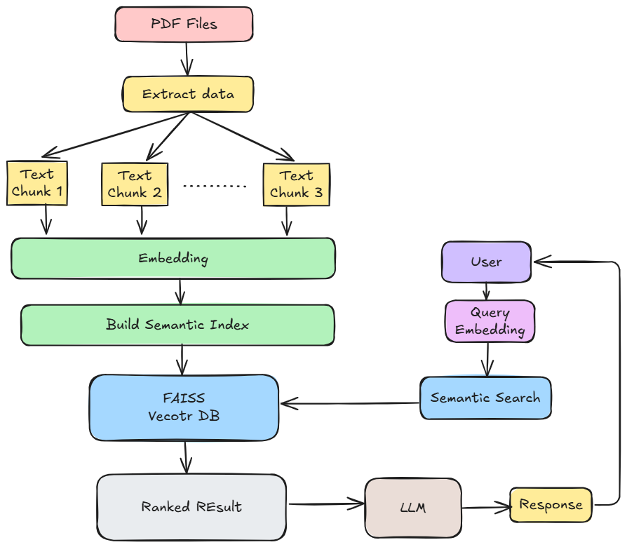

# llm-pdf-reader

**llm-pdf-reader** is a powerful tool that allows you to upload a PDF file and ask questions about its contents. The project leverages Large Language Models (LLMs) with Retrieval-Augmented Generation (RAG) to understand and answer questions based on the PDF’s text.


## 🛠️ Project Setup

1. **Create a Python environment:**

```bash
conda create -n venv python=3.11 -y
```

2. **Activate the environment:**

```bash
conda activate venv
```

3. **Install the required dependencies:**

```bash
pip install -r requirements.txt
```

4. **Create .env file:**

create a .env file to store the api keys.

```bash
OPENAI_API_KEY=<openai_api_key>
GOOGLE_API_KEY=<google_api_key>
```

## ▶️ Running the App

Once the environment is set up and dependencies are installed, run the app using Streamlit:

```bash
streamlit run app.py
```

This will launch a local server, and you can interact with the app through your web browser.

## 📂 File Structure

```
.
├── research
│   └── trials.ipynb
├── src
│   ├── __init__.py
│   └── helper.py
├── .env
├── setup.py
├── template.py
├── app.py              
├── requirements.txt      
└── README.md            
```
## 📂 Project Structure




## 📝 Usage

1. Upload a PDF file through the Streamlit interface.
2. Type in your question in the input box.
3. Get detailed answers directly from the document content!
